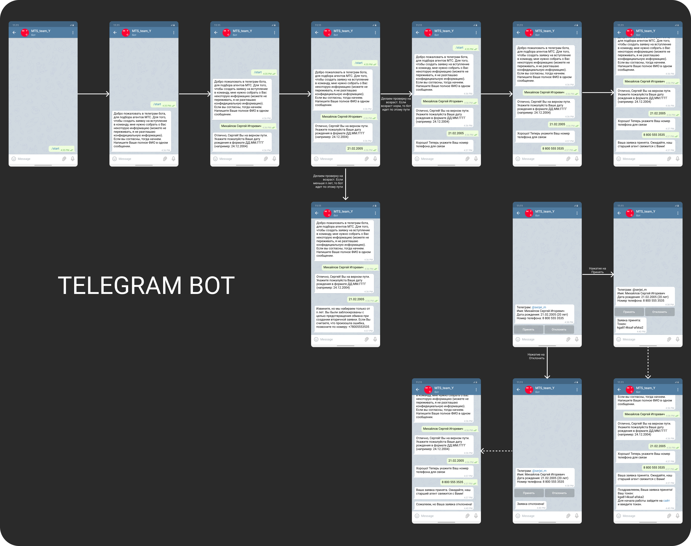

# Form Submission Bot + agents system

A Telegram bot designed to collect user forms and send them to an administrator for review. The bot guides users through a form-filling process, validates input, and allows administrators to accept or decline submissions.

## Features

- Multi-step form collection (name, birth date, phone number)
- Age validation with configurable minimum age
- Admin approval/rejection system with inline buttons
- Token generation for approved users
- Comprehensive logging
- Error handling for Telegram API issues

## Installation

1. Clone the repository:
   ```bash
   https://github.com/IvanArsenev/mts_agents_system
   cd mts_agents_system
   ```

2. Install dependencies:
   ```bash
   pip install -r requirements.txt
   ```

3. Set up environment variables:
   - Create a `.env` file based on the example below
   - Fill in your Telegram bot token and developer chat ID

## Configuration

Create a `.env` file with the following variables:

```ini
TOKEN=your_telegram_bot_token
DEVELOPER_ID=your_chat_id
MIN_AGE=18  # Minimum required age for form submission
```

## Usage

1. Start the bot:
   ```bash
   python bot.py
   ```

2. As a user:
   - Start the bot with `/start` command
   - Follow the instructions to complete the form

3. As an administrator:
   - Receive form submissions in your Telegram chat
   - Approve or reject submissions using inline buttons
   - Approved users will receive an access token

## File Structure

```
.
├── bot.py                # Main bot implementation
├── config.py             # Configuration settings
├── message_texts.py      # All bot message templates
├── README.md             # This file
├── requirements.txt      # Project dependencies
├── .env                  # Environment variables
└── ...                   # Here will be backend and frontend files
```

## Dependencies

- Python 3.11

## Design

### Telegram bot


